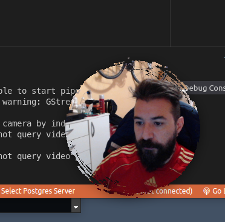

# Webcam Overlay

Motivations: Whenever I share (present) my screen in Google Meet the viewers maximizes the window and the webcams view hide. I feel that when a viewer sees the face of the presenter the ideas are communicated better.
I try using OBS with an overlay but the resolution of the Google Meet Webcam View is 720px max and can downstream to 320px. I searched in internet and didn't find any suitable software and decided to create QT app with a transparent circular overlay window to achieve that.

## How to run it

```python
python3 overlaycam.py
```

## How it works

At start it will detect your available webcams. I have the laptops built in and an usb with higher resolution.

### Mouse actions

- Mouse drag will moves the window possition
- Right button single click cycles the webcam sources
- Middle button single click toggles black and white

### Keyboard actions

- ESC key will ask you if you want to exit or not

## Dependencies

- Computer Vision
- QT5
- Numpy
- PIL

## Screenshot



## Tested in

- Ubuntu 20.04
